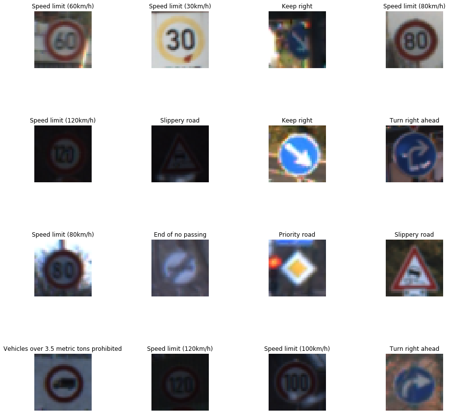
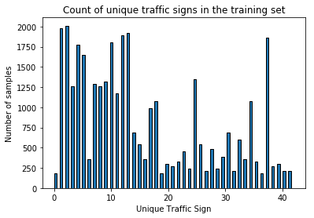
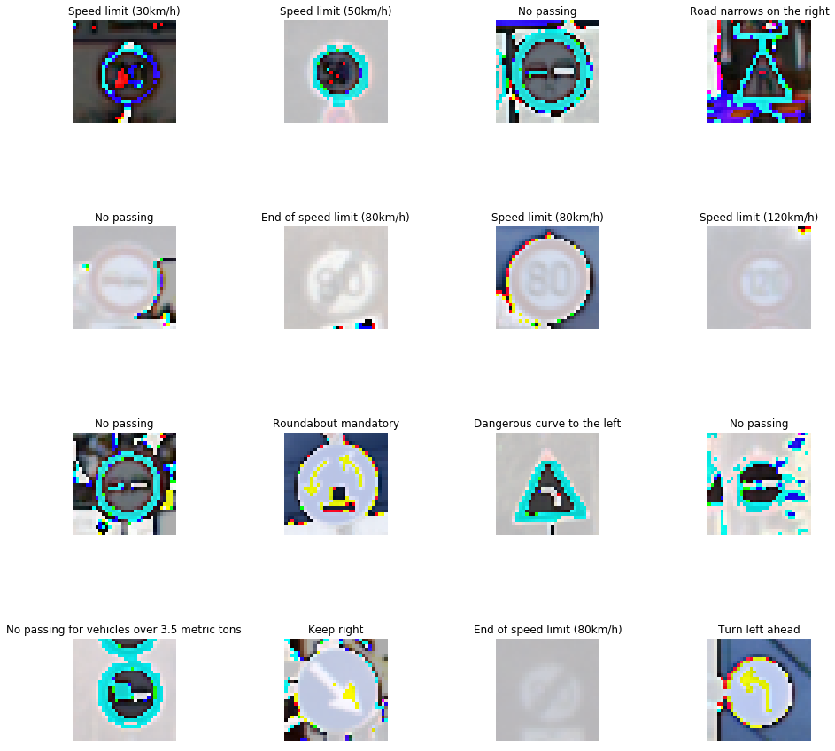
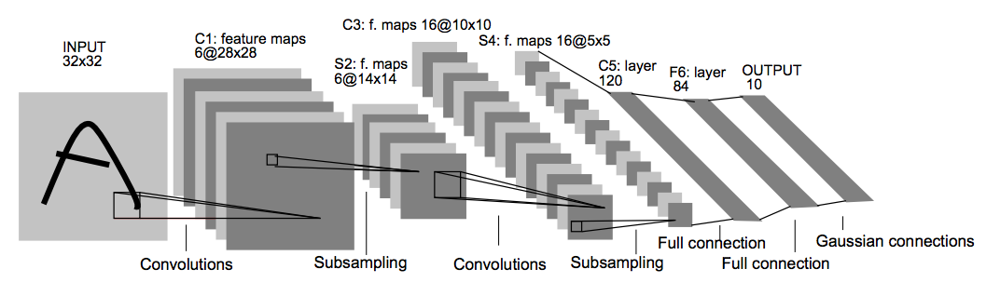
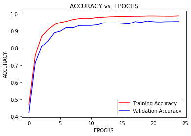
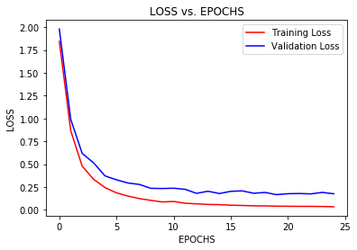
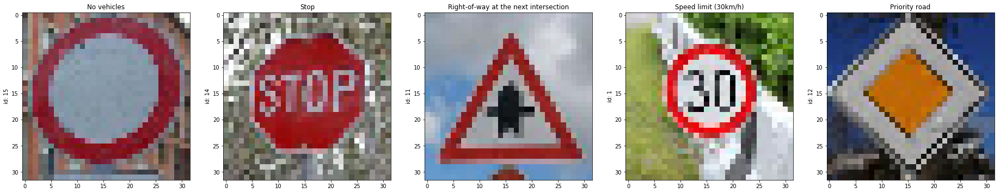
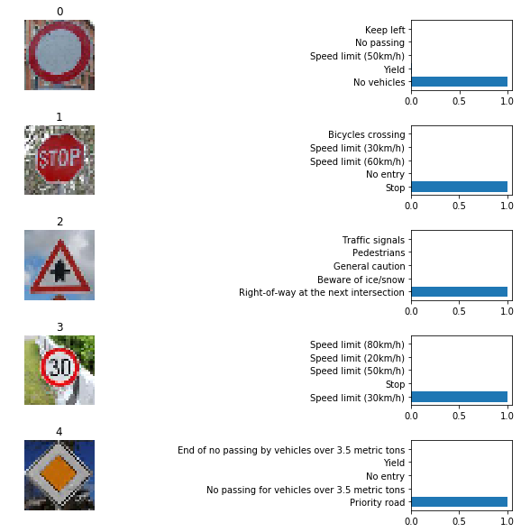

## Project: Build a Traffic Sign Recognition Classifier

In this project, I used a LeNet implementation of a Convolutional Neural Networks to classify traffic signs. Specifically, a model to classify traffic signs from the [German Traffic Sign Dataset](http://benchmark.ini.rub.de/?section=gtsrb&subsection=dataset) was developed.


---
## Step 0: Load The Data


```python
# Load pickled data
import pickle
import os
import csv

# TODO: Fill this in based on where you saved the training and testing data

#fileDir = os.path.dirname(os.path.realpath('__file__'))
#training_file = os.path.join(fileDir, 'traffic-signs-data/train.p')
#validation_file = os.path.join(fileDir, 'traffic-signs-data/valid.p')
#testing_file = os.path.join(fileDir, 'traffic-signs-data/test.p')

training_file = 'traffic-signs-data/train.p'
validation_file = 'traffic-signs-data/valid.p'
testing_file = "traffic-signs-data/test.p"

with open(training_file, mode='rb') as f:
    train = pickle.load(f)
with open(validation_file, mode='rb') as f:
    valid = pickle.load(f)
with open(testing_file, mode='rb') as f:
    test = pickle.load(f)
    
X_train, y_train = train['features'], train['labels']
X_valid, y_valid = valid['features'], valid['labels']
X_test, y_test = test['features'], test['labels']

with open('signnames.csv', mode='r') as f:
    fread = csv.reader(f)
    next(fread, f)
    sign_labels = [rows[1] for rows in fread]
    

```

## Step 1: Dataset Summary & Exploration

The pickled data is a dictionary with 4 key/value pairs:

- `'features'` is a 4D array containing raw pixel data of the traffic sign images, (num examples, width, height, channels).
- `'labels'` is a 1D array containing the label/class id of the traffic sign. The file `signnames.csv` contains id -> name mappings for each id.
- `'sizes'` is a list containing tuples, (width, height) representing the original width and height the image.
- `'coords'` is a list containing tuples, (x1, y1, x2, y2) representing coordinates of a bounding box around the sign in the image. 

### Provide a Basic Summary of the Data Set Using Python, Numpy and/or Pandas


```python
### Replace each question mark with the appropriate value. 
### Use python, pandas or numpy methods rather than hard coding the results

# TODO: Number of training examples
n_train = len(X_train)

# TODO: Number of validation examples
n_validation = len(X_valid)

# TODO: Number of testing examples.
n_test = len(X_test)

# TODO: What's the shape of an traffic sign image?
image_shape = X_train[0].shape

# TODO: How many unique classes/labels there are in the dataset.
n_classes = len(set(y_train))

print("Number of training examples =", n_train)
print("Number of validation examples =", n_validation)
print("Number of testing examples =", n_test)
print("Image data shape =", image_shape)
print("Number of classes =", n_classes)

```

    Number of training examples = 34799
    Number of validation examples = 4410
    Number of testing examples = 12630
    Image data shape = (32, 32, 3)
    Number of classes = 43
    

### Data visualization


```python
### Data exploration visualization code goes here.
### Feel free to use as many code cells as needed.
import matplotlib.pyplot as plt
import matplotlib.gridspec as gridspec

# Visualizations will be shown in the notebook.

%matplotlib inline
import random
import numpy as np
%matplotlib inline

def plot_row_col(rows,cols,X,y):

    plt.figure(figsize = (15,15))
    grid = gridspec.GridSpec(rows,rows)
    # set the spacing between axes.
    grid.update(wspace=1, hspace=1)  

    for i in range(rows*cols):
        img_plt = plt.subplot(grid[i])
        plt.axis('on')
        img_plt.set_xticklabels([])
        img_plt.set_yticklabels([])
        img_plt.set_aspect('equal')
        index = np.random.randint(0,len(X))
        plt.imshow(X[index])
        plt.title(sign_labels[int(y_train[index])])
#        plt.text(2, 4, str(sign_labels[y[index]]), color='k', backgroundcolor='m')
        plt.axis('off')
    plt.show()

plot_row_col(4,4,X_train,y_train)
```





```python
# Plot a histogram with the count of each traffic signs in the training set

plt.hist(y_train, bins=n_classes, edgecolor='black', width=0.5)
plt.title('Count of unique traffic signs in the training set')
plt.xlabel('Unique Traffic Sign')
plt.ylabel('Number of samples')
plt.show()
```





## Step 2: Design and Test a Model Architecture

Design and implement a deep learning model that learns to recognize traffic signs. Train and test your model on the [German Traffic Sign Dataset](http://benchmark.ini.rub.de/?section=gtsrb&subsection=dataset).

### Pre-process the Data Set (normalization, grayscale, etc.)


```python
### Preprocess the data here. It is required to normalize the data. Other preprocessing steps could include 
### converting to grayscale, etc.
### Feel free to use as many code cells as needed.

from sklearn.utils import shuffle
from IPython.display import Image
from IPython.display import display
import cv2
import tensorflow as tf
import time

#Hyperparameters
EPOCHS = 25
BATCH_SIZE = 128
rate = 0.001
dropout = 0.7
augment_num = 250

#Save a copy of the original images
X_train_gold = X_train
X_test_gold = X_test
X_valid_gold = X_valid

#Image augmentation functions
def transform_image(image,ang_range,shear_range,trans_range):

    # Rotation
    ang_rot = np.random.uniform(ang_range)-ang_range/2
    rows,cols,ch = image.shape    
    Rot_M = cv2.getRotationMatrix2D((cols/2,rows/2),ang_rot,1)

    # Translation
    tr_x = trans_range*np.random.uniform()-trans_range/2
    tr_y = trans_range*np.random.uniform()-trans_range/2
    Trans_M = np.float32([[1,0,tr_x],[0,1,tr_y]])

    # Shear
    pts1 = np.float32([[5,5],[20,5],[5,20]])

    pt1 = 5+shear_range*np.random.uniform()-shear_range/2
    pt2 = 20+shear_range*np.random.uniform()-shear_range/2

    pts2 = np.float32([[pt1,5],[pt2,pt1],[5,pt2]])

    shear_M = cv2.getAffineTransform(pts1,pts2)
        
    image = cv2.warpAffine(image,Rot_M,(cols,rows))
    image = cv2.warpAffine(image,Trans_M,(cols,rows))
    image = cv2.warpAffine(image,shear_M,(cols,rows))
    
    return image

# n_add is total number of samples in each category after augmenting. If class 0 had 20 samples, n_add=250 will give 250 samples
# after the gen_new_images function (adds only 220 samples in this example)
def gen_new_images(X_train,y_train,n_add,ang_range,shear_range,trans_range):
   
    ## checking that the inputs are the correct lengths
    assert X_train.shape[0] == len(y_train)
    # Number of classes: 43
    n_class = len(np.unique(y_train))
    X_arr = []
    Y_arr = []
    n_samples = np.bincount(y_train)

    for i in range(n_class):
        # Number of samples in each class

        if n_samples[i] < n_add:
            print ("Adding %d samples for class %d" %(n_add-n_samples[i], i))
            for i_n in range(n_add - n_samples[i]):
                img_trf = transform_image(X_train[i_n],ang_range,shear_range,trans_range) 
                X_arr.append(img_trf)
                Y_arr.append(i)
#                print ("Number of images in class %d:%f" %(i, X_arr[0])) 
           
    X_arr = np.array(X_arr,dtype = np.float32())
    Y_arr = np.array(Y_arr,dtype = np.float32())
   
    return X_arr,Y_arr

# Normalise all original training images (images still in colour)
X_train_norm = (X_train - X_train.mean()) / (np.max(X_train) - np.min(X_train))
X_test_norm = (X_test - X_test.mean()) / (np.max(X_test) - np.min(X_test))
X_valid_norm = (X_valid - X_valid.mean()) / (np.max(X_valid) - np.min(X_valid))

# Assign normalized data back to original variables for ease of use
X_train = X_train_norm
X_test = X_test_norm
X_valid = X_valid_norm

print('Color Image shape before augmentation:', X_train.shape)
#Generate new images using the original (not normalized) images
X_train_aug,y_train_aug = gen_new_images(X_train_gold,y_train,augment_num,30,5,5)
## combine the generated images and the original training set
X_train = np.append(X_train, X_train_aug, axis=0)
y_train = np.append(y_train, y_train_aug, axis=0)
print('Color Image shape after augmentation:', X_train.shape)
#print('Asserting Xtrain 0 shape:', X_train.shape[0])
#print('Asserting Xtrain 0 shape:', len(y_train))

plot_row_col(4,4,X_train,y_train)


```

    Color Image shape before augmentation: (34799, 32, 32, 3)
    Adding 70 samples for class 0
    Adding 70 samples for class 19
    Adding 10 samples for class 24
    Adding 40 samples for class 27
    Adding 10 samples for class 29
    Adding 40 samples for class 32
    Adding 70 samples for class 37
    Adding 40 samples for class 41
    Adding 40 samples for class 42
    Color Image shape after augmentation: (35189, 32, 32, 3)
    





#### Question 1. Describe how you preprocessed the image data. What techniques were chosen and why did you choose these techniques? Consider including images showing the output of each preprocessing technique. 

#### Answer: All the images were normalized so that the data has a mean of zero and equal variance. This helps the model converge faster. Since there was an uneven distribution of the number of images for each class as shown in the histogram of the training set images, I added augmented images for some classes such that the minimum number of images in each class is 250 images. For the augmented images, I applied a transform function which randomly rotates, translates and shears the input image. The total number of training images before & after augmentation were 34799 & 35189 respectively. Images before and after preprocessing were plotted at the end of Step 1 & Step 2 above.

###### References: [Dealing with unbalanced data: Generating additional data by jittering the original image](https://medium.com/@vivek.yadav/dealing-with-unbalanced-data-generating-additional-data-by-jittering-the-original-image-7497fe2119c3)

### Model Architecture


```python
### Define your architecture here.
### Feel free to use as many code cells as needed.

from tensorflow.contrib.layers import flatten

def LeNet(x, keep_prob):    
    # Arguments used for tf.truncated_normal, randomly defines variables for the weights and biases for each layer
    mu = 0
    sigma = 0.1
    
    # SOLUTION: Layer 1: Convolutional. Input = 32x32x3. Output = 28x28x6.
    conv1_W = tf.Variable(tf.truncated_normal(shape=(5, 5, 3, 6), mean = mu, stddev = sigma))
    conv1_b = tf.Variable(tf.zeros(6))
    conv1   = tf.nn.conv2d(x, conv1_W, strides=[1, 1, 1, 1], padding='VALID') + conv1_b

    # SOLUTION: Activation.
    conv1 = tf.nn.relu(conv1)

    # SOLUTION: Pooling. Input = 28x28x6. Output = 14x14x6.
    conv1 = tf.nn.max_pool(conv1, ksize=[1, 2, 2, 1], strides=[1, 2, 2, 1], padding='VALID')

    # SOLUTION: Layer 2: Convolutional. Output = 10x10x16.
    conv2_W = tf.Variable(tf.truncated_normal(shape=(5, 5, 6, 16), mean = mu, stddev = sigma))
    conv2_b = tf.Variable(tf.zeros(16))
    conv2   = tf.nn.conv2d(conv1, conv2_W, strides=[1, 1, 1, 1], padding='VALID') + conv2_b
    
    # SOLUTION: Activation.
    conv2 = tf.nn.relu(conv2)

    # SOLUTION: Pooling. Input = 10x10x16. Output = 5x5x16.
    conv2 = tf.nn.max_pool(conv2, ksize=[1, 2, 2, 1], strides=[1, 2, 2, 1], padding='VALID')

    # SOLUTION: Flatten. Input = 5x5x16. Output = 400.
    fc0   = flatten(conv2)
# Adding dropout
#    fc0 = tf.nn.dropout(fc0, keep_prob)
    
    # SOLUTION: Layer 3: Fully Connected. Input = 400. Output = 120.
    fc1_W = tf.Variable(tf.truncated_normal(shape=(400, 120), mean = mu, stddev = sigma))
    fc1_b = tf.Variable(tf.zeros(120))
    fc1   = tf.matmul(fc0, fc1_W) + fc1_b
    
    # SOLUTION: Activation.
    fc1    = tf.nn.relu(fc1)
    # Adding dropout
    fc1 = tf.nn.dropout(fc1, keep_prob)

    # SOLUTION: Layer 4: Fully Connected. Input = 120. Output = 84.
    fc2_W  = tf.Variable(tf.truncated_normal(shape=(120, 84), mean = mu, stddev = sigma))
    fc2_b  = tf.Variable(tf.zeros(84))
    fc2    = tf.matmul(fc1, fc2_W) + fc2_b    

    # SOLUTION: Activation.
    fc2    = tf.nn.relu(fc2)
    # Adding dropout
    fc2 = tf.nn.dropout(fc2, keep_prob)

    # SOLUTION: Layer 5: Fully Connected. Input = 84. Output = 10.
    fc3_W  = tf.Variable(tf.truncated_normal(shape=(84, 43), mean = mu, stddev = sigma))
    fc3_b  = tf.Variable(tf.zeros(43))
    logits = tf.matmul(fc2, fc3_W) + fc3_b
    
    return logits

```

#### Question 2. Describe what your final model architecture looks like including model type, layers, layer sizes, connectivity, etc.) Consider including a diagram and/or table describing the final model.

#### Answer: I used the LeNet architecture (shown in image below) as-is since I was getting above 93% training and validation accuracy using this model after preprocessing and augmentation of the input training set. The image below shows the number of layers, layer sizes & connectivity of the model. There is further room for improvement experimenting with different models such as the one suggested in the [published baseline model to solve a traffic classifier problem](http://yann.lecun.com/exdb/publis/pdf/sermanet-ijcnn-11.pdf).

 
Source: Yann LeCun

### Train, Validate and Test the Model

A validation set can be used to assess how well the model is performing. A low accuracy on the training and validation
sets imply underfitting. A high accuracy on the training set but low accuracy on the validation set implies overfitting.


```python
#`x` is a placeholder for a batch of input images.
#`y` is a placeholder for a batch of output labels.

x = tf.placeholder(tf.float32, (None, 32, 32, 3))
y = tf.placeholder(tf.int32, (None))
keep_prob = tf.placeholder(tf.float32, (None))
one_hot_y = tf.one_hot(y, 43)

### Train your model here.
### Calculate and report the accuracy on the training and validation set.
### Once a final model architecture is selected, 
### the accuracy on the test set should be calculated and reported as well.
### Feel free to use as many code cells as needed.


logits = LeNet(x, keep_prob)
cross_entropy = tf.nn.softmax_cross_entropy_with_logits(labels=one_hot_y, logits=logits)
loss_operation = tf.reduce_mean(cross_entropy)
optimizer = tf.train.AdamOptimizer(learning_rate = rate)
training_operation = optimizer.minimize(loss_operation)

# Evaluate how well the loss and accuracy of the model for a given dataset.

correct_prediction = tf.equal(tf.argmax(logits, 1), tf.argmax(one_hot_y, 1))
accuracy_operation = tf.reduce_mean(tf.cast(correct_prediction, tf.float32))
saver = tf.train.Saver()

def evaluate(X_data, y_data):
    num_examples = len(X_data)
    total_accuracy = 0
    sess = tf.get_default_session()
    for offset in range(0, num_examples, BATCH_SIZE):
        batch_x, batch_y = X_data[offset:offset+BATCH_SIZE], y_data[offset:offset+BATCH_SIZE]
        accuracy = sess.run(accuracy_operation, feed_dict={x: batch_x, y: batch_y, keep_prob: 1})
        total_accuracy += (accuracy * len(batch_x))
    return total_accuracy / num_examples

def evaluate_loss(X_data, y_data):
    num_examples = len(X_data)
    total_loss = 0
    sess = tf.get_default_session()
    for offset in range(0, num_examples, BATCH_SIZE):
        batch_x, batch_y = X_data[offset:offset+BATCH_SIZE], y_data[offset:offset+BATCH_SIZE]
        loss = sess.run(loss_operation, feed_dict={x: batch_x, y: batch_y, keep_prob: 1})
        total_loss += (loss * len(batch_x))
    return total_loss / num_examples

#Train the model
#Run the training data through the training pipeline to train the model.
#Before each epoch, shuffle the training set.
#After each epoch, measure the loss and accuracy of the validation set.
#Save the model after training.

with tf.Session() as sess:
    sess.run(tf.global_variables_initializer())
    num_examples = len(X_train)
    
    pts_train_acc = []
    pts_train_loss = []
    pts_valid_acc = []
    pts_valid_loss = []
    
    print("Training...")
    print()
    # Trying different drop_out rates for optimal results
#    for dropout in [0.5, 0.6, 0.7, 0.8, 0.9]:
    for i in range(EPOCHS):
            begin =  time.time()
            X_train, y_train = shuffle(X_train, y_train)
            for offset in range(0, num_examples, BATCH_SIZE):
                end = offset + BATCH_SIZE
                batch_x, batch_y = X_train[offset:end], y_train[offset:end]
                sess.run(training_operation, feed_dict={x: batch_x, y: batch_y, keep_prob: dropout})
            
            training_accuracy = evaluate(X_train, y_train)
            pts_train_acc.append(training_accuracy)
            training_loss = evaluate_loss(X_train, y_train)
            pts_train_loss.append(training_loss)

            validation_accuracy = evaluate(X_valid, y_valid)
            pts_valid_acc.append(validation_accuracy)
            validation_loss = evaluate_loss(X_valid, y_valid)
            pts_valid_loss.append(validation_loss)
            
            print("EPOCH {} ...".format(i+1))
            print("Drop Out = {:.1f}".format(dropout))
            print("Training Accuracy = {:.3f}".format(training_accuracy))
            print("Validation Accuracy = {:.3f}".format(validation_accuracy))
            print("Training Loss = {:.3f}".format(training_loss))
            print("Validation Loss = {:.3f}".format(validation_loss))
            print("Processing time = {:.2f} seconds".format(time.time() - begin))
            print()
        
    saver.save(sess, './TrSignClass.ckpt')
    print("Model saved")

    plt.plot(range(EPOCHS), pts_train_acc, 'r', label='Training Accuracy')
    plt.plot(range(EPOCHS), pts_valid_acc, 'b', label='Validation Accuracy')
    plt.xlabel('EPOCHS')
    plt.ylabel('ACCURACY')
    plt.title('ACCURACY vs. EPOCHS')
    plt.legend(loc='best')
    plt.show()

    plt.plot(range(EPOCHS), pts_train_loss, 'r', label='Training Loss')
    plt.plot(range(EPOCHS), pts_valid_loss, 'b', label='Validation Loss')
    plt.xlabel('EPOCHS')
    plt.ylabel('LOSS')
    plt.title('LOSS vs. EPOCHS')
    plt.legend(loc='best')
    plt.show()


```

    Training...
    
    EPOCH 1 ...
    Drop Out = 0.7
    Training Accuracy = 0.472
    Validation Accuracy = 0.424
    Training Loss = 1.845
    Validation Loss = 1.980
    Processing time = 5.97 seconds
    
    EPOCH 2 ...
    Drop Out = 0.7
    Training Accuracy = 0.757
    Validation Accuracy = 0.715
    Training Loss = 0.866
    Validation Loss = 0.990
    Processing time = 5.58 seconds
    
    EPOCH 3 ...
    Drop Out = 0.7
    Training Accuracy = 0.867
    Validation Accuracy = 0.807
    Training Loss = 0.480
    Validation Loss = 0.619
    Processing time = 5.58 seconds
    
    EPOCH 4 ...
    Drop Out = 0.7
    Training Accuracy = 0.907
    Validation Accuracy = 0.841
    Training Loss = 0.335
    Validation Loss = 0.515
    Processing time = 5.56 seconds
    
    EPOCH 5 ...
    Drop Out = 0.7
    Training Accuracy = 0.935
    Validation Accuracy = 0.889
    Training Loss = 0.244
    Validation Loss = 0.372
    Processing time = 5.56 seconds
    
    EPOCH 6 ...
    Drop Out = 0.7
    Training Accuracy = 0.949
    Validation Accuracy = 0.898
    Training Loss = 0.187
    Validation Loss = 0.329
    Processing time = 5.61 seconds
    
    EPOCH 7 ...
    Drop Out = 0.7
    Training Accuracy = 0.956
    Validation Accuracy = 0.920
    Training Loss = 0.152
    Validation Loss = 0.295
    Processing time = 5.62 seconds
    
    EPOCH 8 ...
    Drop Out = 0.7
    Training Accuracy = 0.966
    Validation Accuracy = 0.918
    Training Loss = 0.124
    Validation Loss = 0.279
    Processing time = 5.59 seconds
    
    EPOCH 9 ...
    Drop Out = 0.7
    Training Accuracy = 0.972
    Validation Accuracy = 0.932
    Training Loss = 0.105
    Validation Loss = 0.237
    Processing time = 5.60 seconds
    
    EPOCH 10 ...
    Drop Out = 0.7
    Training Accuracy = 0.975
    Validation Accuracy = 0.932
    Training Loss = 0.087
    Validation Loss = 0.234
    Processing time = 5.59 seconds
    
    EPOCH 11 ...
    Drop Out = 0.7
    Training Accuracy = 0.974
    Validation Accuracy = 0.932
    Training Loss = 0.093
    Validation Loss = 0.238
    Processing time = 5.51 seconds
    
    EPOCH 12 ...
    Drop Out = 0.7
    Training Accuracy = 0.979
    Validation Accuracy = 0.936
    Training Loss = 0.073
    Validation Loss = 0.226
    Processing time = 5.58 seconds
    
    EPOCH 13 ...
    Drop Out = 0.7
    Training Accuracy = 0.980
    Validation Accuracy = 0.947
    Training Loss = 0.067
    Validation Loss = 0.182
    Processing time = 5.54 seconds
    
    EPOCH 14 ...
    Drop Out = 0.7
    Training Accuracy = 0.983
    Validation Accuracy = 0.946
    Training Loss = 0.060
    Validation Loss = 0.205
    Processing time = 5.57 seconds
    
    EPOCH 15 ...
    Drop Out = 0.7
    Training Accuracy = 0.984
    Validation Accuracy = 0.947
    Training Loss = 0.058
    Validation Loss = 0.180
    Processing time = 5.61 seconds
    
    EPOCH 16 ...
    Drop Out = 0.7
    Training Accuracy = 0.985
    Validation Accuracy = 0.944
    Training Loss = 0.052
    Validation Loss = 0.204
    Processing time = 5.58 seconds
    
    EPOCH 17 ...
    Drop Out = 0.7
    Training Accuracy = 0.985
    Validation Accuracy = 0.941
    Training Loss = 0.049
    Validation Loss = 0.208
    Processing time = 5.60 seconds
    
    EPOCH 18 ...
    Drop Out = 0.7
    Training Accuracy = 0.986
    Validation Accuracy = 0.954
    Training Loss = 0.045
    Validation Loss = 0.183
    Processing time = 5.59 seconds
    
    EPOCH 19 ...
    Drop Out = 0.7
    Training Accuracy = 0.986
    Validation Accuracy = 0.950
    Training Loss = 0.044
    Validation Loss = 0.191
    Processing time = 5.61 seconds
    
    EPOCH 20 ...
    Drop Out = 0.7
    Training Accuracy = 0.987
    Validation Accuracy = 0.958
    Training Loss = 0.041
    Validation Loss = 0.167
    Processing time = 5.61 seconds
    
    EPOCH 21 ...
    Drop Out = 0.7
    Training Accuracy = 0.987
    Validation Accuracy = 0.953
    Training Loss = 0.040
    Validation Loss = 0.177
    Processing time = 5.59 seconds
    
    EPOCH 22 ...
    Drop Out = 0.7
    Training Accuracy = 0.987
    Validation Accuracy = 0.952
    Training Loss = 0.039
    Validation Loss = 0.180
    Processing time = 5.61 seconds
    
    EPOCH 23 ...
    Drop Out = 0.7
    Training Accuracy = 0.986
    Validation Accuracy = 0.954
    Training Loss = 0.039
    Validation Loss = 0.175
    Processing time = 5.59 seconds
    
    EPOCH 24 ...
    Drop Out = 0.7
    Training Accuracy = 0.986
    Validation Accuracy = 0.954
    Training Loss = 0.038
    Validation Loss = 0.192
    Processing time = 5.59 seconds
    
    EPOCH 25 ...
    Drop Out = 0.7
    Training Accuracy = 0.988
    Validation Accuracy = 0.955
    Training Loss = 0.035
    Validation Loss = 0.177
    Processing time = 5.59 seconds
    
    Model saved
    








#### Question 3. Describe how you trained your model. The discussion can include the type of optimizer, the batch size, number of epochs and any hyperparameters such as learning rate.

#### Answer: To train the model, I used the following hyperparameters after some experimentation with image preprocessing & the number of augmented images, number of epochs, and dropout rates. Eventually, I settled on the following hyperparameters: EPOCHS = 25, BATCH_SIZE = 128, learning rate = 0.001, dropout = 0.7. I used dropout on the fully connected layers 1 & 2 since maxpool was used on fully connected layer 0. My final training accuracy is 98.8%, validation accuracy is 95.5%, and test set accuracy is 93.3%. I also used the Adam optimizer which helps the model converge faster, although it requires more computing resources. As I used AWS to train the model, computing resources were not an issue. 

#### Looking at the training loss vs. validation loss curves above, it seems like the model has high variance which is an overfitting problem. There is room for improvement to address this overfitting issue with several different approaches: an iterative approach to experiment with different learning rates and changing the hyperparameters dynamically after a certain number of epochs. I haven't experimented with L2 regularization and it is another avenue to explore further to improve the model performance when time permits.


```python
#Test the model
with tf.Session() as sess:
#    saver.restore(sess, tf.train.latest_checkpoint('.'))
    saver.restore(sess, './TrSignClass.ckpt')
    
    test_accuracy = evaluate(X_test, y_test)
    print("Test Accuracy = {:.3f}".format(test_accuracy))
```

    Test Accuracy = 0.933
    

## Step 3: Test a Model on New Images

### Load and Output the Images


```python
### Load the images and plot them here.
### Feel free to use as many code cells as needed.
import os
import cv2
import matplotlib.image as mpimg

image_path = os.listdir("NewImages")
n_images = list()
n_labels = list()

# read images from directory and resize
for impath in image_path:
    img = mpimg.imread(os.path.join("NewImages", impath))
    img = cv2.resize(img, image_shape[0:2], interpolation=cv2.INTER_CUBIC)
    n_images.append(img)
    
# The prefix of every image name is the category number of the traffic sign
    n_labels.append(int(impath[0:impath.find('-')]))
    
n_images = np.array(n_images)
n_labels = np.array(n_labels)

# keep an original copy
n_images_gold = n_images
n_labels_gold = n_images

# Output the re-sized images
imdim = image_shape[0]
fig = plt.figure(figsize=(imdim,imdim))
for i in range(0, len(n_images)):
    ax = fig.add_subplot(1, len(n_images), i+1)
    ax.set_title(sign_labels[int(n_labels[i])])
    ax.set_ylabel("id: {id}".format(id=n_labels[i]))
    plt.imshow(n_images[i])
plt.show()
```





#### Question 4. Choose five German traffic signs found on the web and provide them in the report. For each image, discuss what quality or qualities might be difficult to classify.

#### Answer: The five images that were picked were pixelated, at different angles, with different backgrounds that could make these images difficult to classify. I could have picked images which are much worse and harder to classify including some which are not in the type of class provided. This is an exercise for the future when I have more time to experiment with other images.

### Predict the Sign Type for Each Image


```python
### Run the predictions here and use the model to output the prediction for each image.
### Make sure to pre-process the images with the same pre-processing pipeline used earlier.
### Feel free to use as many code cells as needed.

# Pre-process the new images 
n_images_norm = (n_images - n_images.mean()) / (np.max(n_images) - np.min(n_images))
n_images = n_images_norm

#Make a prediction on the new images using the trained model
with tf.Session() as sess:
    saver.restore(sess, './TrSignClass.ckpt')
    sign_ids = sess.run(tf.argmax(logits, 1), feed_dict={x: n_images, y: n_labels, keep_prob: 1})

# output the results in the table
print('-' * 98)
print(" {p:^48} | {a:^48} ".format(p='PREDICTED', a='ACTUAL'))
print('-' * 98)
for i in range(len(sign_ids)):
    print(' {p:^2} {strp:^45} | {a:^2} {stra:^45} '.format(
        p=sign_ids[i], strp=sign_labels[int(sign_ids[i])], a=n_labels[i], stra=sign_labels[int(n_labels[i])]))
```

    --------------------------------------------------------------------------------------------------
                        PREDICTED                     |                      ACTUAL                      
    --------------------------------------------------------------------------------------------------
     15                  No vehicles                  | 15                  No vehicles                  
     14                     Stop                      | 14                     Stop                      
     11     Right-of-way at the next intersection     | 11     Right-of-way at the next intersection     
     1              Speed limit (30km/h)              | 1              Speed limit (30km/h)              
     12                 Priority road                 | 12                 Priority road                 
    

#### Question 5. Discuss the model's predictions on these new traffic signs and compare the results to predicting on the test set. At a minimum, discuss what the predictions were, the accuracy on these new predictions, and compare the accuracy to the accuracy on the test set 
#### Answer: As seen above, the model accurately predicted all of the five signs from the new image set. Thinking back, I should have picked some images with classes that were not in the training & validation sets which would provide more insight into the classifier model.

### Analyze Performance


```python
### Calculate the accuracy for these 5 new images. 
### For example, if the model predicted 1 out of 5 signs correctly, it's 20% accurate on these new images.
```

### Output Top 5 Softmax Probabilities For Each Image Found on the Web

For each of the new images, print out the model's softmax probabilities to show the **certainty** of the model's predictions (limit the output to the top 5 probabilities for each image). [`tf.nn.top_k`](https://www.tensorflow.org/versions/r0.12/api_docs/python/nn.html#top_k) could prove helpful here. 

The example below demonstrates how tf.nn.top_k can be used to find the top k predictions for each image.

`tf.nn.top_k` will return the values and indices (class ids) of the top k predictions. So if k=3, for each sign, it'll return the 3 largest probabilities (out of a possible 43) and the correspoding class ids.

Take this numpy array as an example. The values in the array represent predictions. The array contains softmax probabilities for five candidate images with six possible classes. `tk.nn.top_k` is used to choose the three classes with the highest probability:

```
# (5, 6) array
a = np.array([[ 0.24879643,  0.07032244,  0.12641572,  0.34763842,  0.07893497,
         0.12789202],
       [ 0.28086119,  0.27569815,  0.08594638,  0.0178669 ,  0.18063401,
         0.15899337],
       [ 0.26076848,  0.23664738,  0.08020603,  0.07001922,  0.1134371 ,
         0.23892179],
       [ 0.11943333,  0.29198961,  0.02605103,  0.26234032,  0.1351348 ,
         0.16505091],
       [ 0.09561176,  0.34396535,  0.0643941 ,  0.16240774,  0.24206137,
         0.09155967]])
```

Running it through `sess.run(tf.nn.top_k(tf.constant(a), k=3))` produces:

```
TopKV2(values=array([[ 0.34763842,  0.24879643,  0.12789202],
       [ 0.28086119,  0.27569815,  0.18063401],
       [ 0.26076848,  0.23892179,  0.23664738],
       [ 0.29198961,  0.26234032,  0.16505091],
       [ 0.34396535,  0.24206137,  0.16240774]]), indices=array([[3, 0, 5],
       [0, 1, 4],
       [0, 5, 1],
       [1, 3, 5],
       [1, 4, 3]], dtype=int32))
```

Looking just at the first row we get `[ 0.34763842,  0.24879643,  0.12789202]`, you can confirm these are the 3 largest probabilities in `a`. You'll also notice `[3, 0, 5]` are the corresponding indices.


```python
### Print out the top five softmax probabilities for the predictions on the German traffic sign images found on the web. 
### Feel free to use as many code cells as needed.
# Print out the top five softmax probabilities for the predictions on 
# the German traffic sign images found on the web. 

with tf.Session() as sess:
    saver.restore(sess, './TrSignClass.ckpt')
    top_5 = sess.run(tf.nn.top_k(tf.nn.softmax(logits), k=5), 
                     feed_dict={x: n_images, y: n_labels, keep_prob: 1})
print(top_5)

plt.figure(figsize=(10, 10))
for i in range(5):
    plt.subplot(5, 2, 2*i+1)
    plt.subplots_adjust(wspace=3, hspace=0.5)
    plt.imshow(n_images_gold[i]) 
    plt.title(i)
    plt.axis('off')
    plt.subplot(5, 2, 2*i+2)
    plt.barh(np.arange(1, 6, 1), top_5.values[i, :])
    labelss=[sign_labels[j] for j in top_5.indices[i]]
    plt.yticks(np.arange(1, 6, 1), labelss)
plt.show()

```

    TopKV2(values=array([[  9.94849861e-01,   4.02608421e-03,   8.81813059e-04,
              1.12682443e-04,   1.00235797e-04],
           [  1.00000000e+00,   8.13595025e-11,   4.84609965e-12,
              1.13828619e-12,   5.86009973e-13],
           [  1.00000000e+00,   3.91001509e-10,   1.69469216e-13,
              3.75367309e-15,   4.89435337e-21],
           [  9.99663353e-01,   3.32848547e-04,   2.58253181e-06,
              6.62717923e-07,   3.61570244e-07],
           [  1.00000000e+00,   3.79511037e-15,   4.28620310e-17,
              3.68460689e-17,   2.11135928e-18]], dtype=float32), indices=array([[15, 13,  2,  9, 39],
           [14, 17,  3,  1, 29],
           [11, 30, 18, 27, 26],
           [ 1, 14,  2,  0,  5],
           [12, 10, 17, 13, 42]], dtype=int32))
    





#### Question 6. Describe how certain the model is when predicting on each of the five new images by looking at the softmax probabilities for each prediction. Provide the top 5 softmax probabilities for each image along with the sign type of each probability. (OPTIONAL: as described in the "Stand Out Suggestions" part of the rubric, visualizations can also be provided such as bar charts)

#### Answer: The code for making predictions on my final model is located in the 13th cell of this Ipython notebook. For all the images, the model is highly confident of predicting the first of the top 5 softmax probabilities as they vary from 99.48% to 100% as shown in the results above. The model is also not confident in predicting the next closest sign since the other four softmax probabilities are close to zero. As pointed out in answer 5, when time permits I will include more images which are much harder to classify.

### Project Writeup

Once you have completed the code implementation, document your results in a project writeup using this [template](https://github.com/udacity/CarND-Traffic-Sign-Classifier-Project/blob/master/writeup_template.md) as a guide. The writeup can be in a markdown or pdf file. 

> **Note**: Once you have completed all of the code implementations and successfully answered each question above, you may finalize your work by exporting the iPython Notebook as an HTML document. You can do this by using the menu above and navigating to  \n",
    "**File -> Download as -> HTML (.html)**. Include the finished document along with this notebook as your submission.
